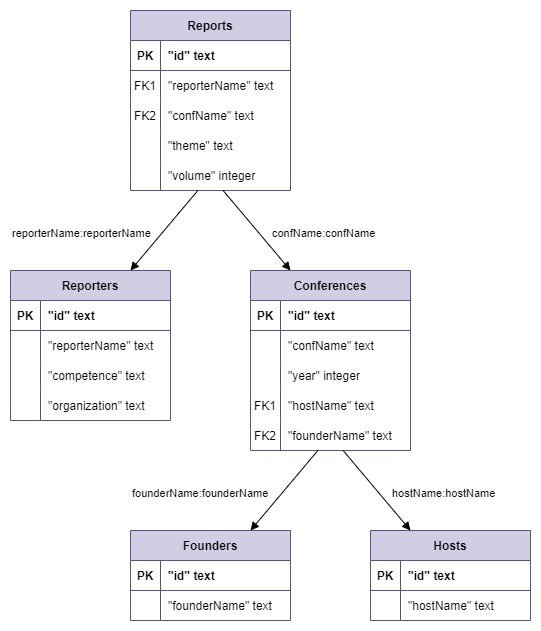

# Reports Web
*Repository for Web App Development discipline*

> ***ToDo:*** *set connection with postgresql*

**Subject area:** Reports
## Explanation of Reports subject area
- Report:
	- id - not null, unique, string;
	- theme - not null, string;
	- value - string;
	- reporterName - string;;
	- conferenceName - string;;

- Reporter:
	- id - not null, unique, string;
	- reporterName - not null, string;
	- competence - string;;
	- organization - string;;

- Conference:
	- id - not null, unique, string;
	- confName - not null, string;
	- year - number;
	- hostName - string;
	- founderName - string;

- Host:
	- id - not null, unique, string;
	- hostName - not null, string;

- Founder:
	- id - not null, unique, string;
	- founderName - not null, string;

## ERD for Reports subject area

